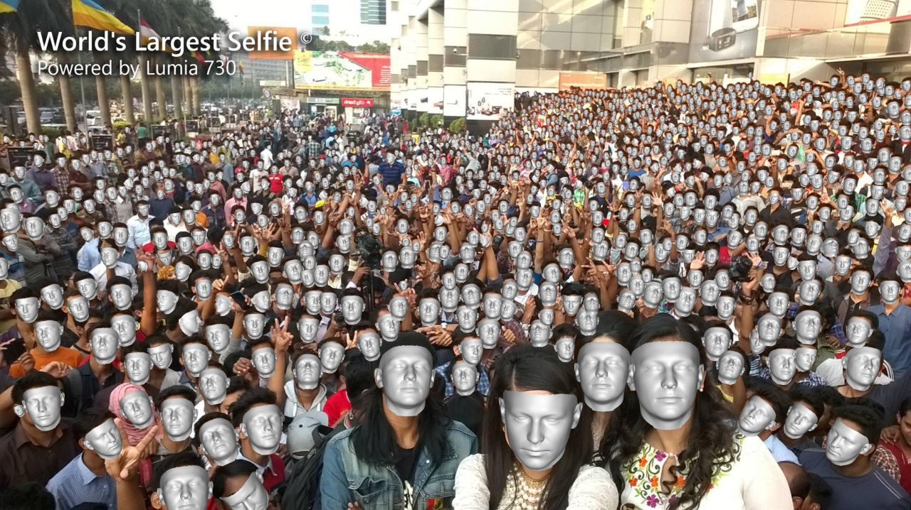

# img2pose: Face Alignment and Detection via 6DoF, Face Pose Estimation

## Paper accepted to the IEEE Conference on Computer Vision and Pattern Recognition (CVPR) 2021

[](https://creativecommons.org/licenses/by-nc/4.0/)
[](https://paperswithcode.com/sota/head-pose-estimation-on-aflw2000?p=img2pose-face-alignment-and-detection-via)
[](https://paperswithcode.com/sota/head-pose-estimation-on-biwi?p=img2pose-face-alignment-and-detection-via)

<figure>
  
  <figcaption>Figure 1: We estimate the 6DoF rigid transformation of a 3D face (rendered in silver), aligning it with even the tiniest faces, without face detection or facial landmark localization. Our estimated 3D face locations are rendered by descending distances from the camera, for coherent visualization.</figcaption>
</figure>

## TL;DR
This repository provides a novel method for six degrees of fredoom (6DoF) detection on multiple faces without the need of prior face detection. After prediction, one can visualize the detections (as show in the figure above), customize projected bounding boxes, or crop and align each face for further processing. See details below.

## Table of contents

<!--ts-->
- [Paper details](#paper-details)
  * [Abstract](#abstract)
  * [Video Spotlight](#video-spotlight)
  * [Citation](#citation)
- [Installation](#installation)
- [Training](#training)
  * [Prepare WIDER FACE dataset](#prepare-wider-face-dataset)
  * [Train](#train)
  * [Training on your own dataset](#training-on-your-own-dataset)
- [Testing](#testing)
  * [Visualizing trained model](#visualizing-trained-model)
  * [WIDER FACE dataset evaluation](#wider-face-dataset-evaluation)  
  * [AFLW2000-3D dataset evaluation](#aflw2000-3d-dataset-evaluation)
  * [BIWI dataset evaluation](#biwi-dataset-evaluation)
  * [Testing on your own images](#testing-on-your-own-images)
- [Output customization](#output-customization)
- [Align faces](#align-faces)
- [Resources](#resources)
- [License](#license)
<!--te-->

## Paper details

[Vítor Albiero](https://vitoralbiero.netlify.app), Xingyu Chen, [Xi Yin](https://xiyinmsu.github.io/), Guan Pang, [Tal Hassner](https://talhassner.github.io/home/), "*img2pose: Face Alignment and Detection via 6DoF, Face Pose Estimation,*" CVPR, 2021, [arXiv:2012.07791](https://arxiv.org/abs/2012.07791)


### Abstract
> We propose real-time, six degrees of freedom (6DoF), 3D face pose estimation without face detection or landmark localization. We observe that estimating the 6DoF rigid transformation of a face is a simpler problem than facial landmark detection, often used for 3D face alignment. In addition, 6DoF offers more information than face bounding box labels. We leverage these observations to make multiple contributions: (a) We describe an easily trained, efficient, Faster R-CNN--based model which regresses 6DoF pose for all faces in the photo, without preliminary face detection. (b) We explain how pose is converted and kept consistent between the input photo and arbitrary crops created while training and evaluating our model. (c) Finally, we show how face poses can replace detection bounding box training labels. Tests on AFLW2000-3D and BIWI show that our method runs at real-time and outperforms state of the art (SotA) face pose estimators. Remarkably, our method also surpasses SotA models of comparable complexity on the WIDER FACE detection benchmark, despite not been optimized on bounding box labels.

### Video Spotlight
[CVPR 2021 Spotlight](https://youtu.be/vDGlvpnzXGo)

### Citation
If you use any part of our code or data, please cite our paper.
```
@inproceedings{albiero2021img2pose,
  title={img2pose: Face Alignment and Detection via 6DoF, Face Pose Estimation},
  author={Albiero, Vítor and Chen, Xingyu and Yin, Xi and Pang, Guan and Hassner, Tal},
  booktitle={CVPR},
  year={2021},
  url={https://arxiv.org/abs/2012.07791},
}
```

## Installation
 

Install dependecies with Python 3.
```
pip install -r requirements.txt
```
Install the renderer, which is used to visualize predictions. The renderer implementation is forked from [here](https://github.com/cleardusk/3DDFA_V2/tree/master/Sim3DR).
```
cd Sim3DR
sh build_sim3dr.sh
```

## Training
### Prepare WIDER FACE dataset
First, download our annotations as instructed in [Annotations](https://github.com/vitoralbiero/img2pose/wiki/Annotations).

Download [WIDER FACE](http://shuoyang1213.me/WIDERFACE/) dataset and extract to datasets/WIDER_Face.

Then, to create the train and validation files (LMDB), run the following scripts.

```
python3 convert_json_list_to_lmdb.py \
--json_list ./annotations/WIDER_train_annotations.txt \
--dataset_path ./datasets/WIDER_Face/WIDER_train/images/ \
--dest ./datasets/lmdb/ \
-—train
```
This first script will generate a LMDB dataset, which contains the training images along with annotations. It will also output a pose mean and std deviation files, which will be used for training and testing.
```
python3 convert_json_list_to_lmdb.py  \
--json_list ./annotations/WIDER_val_annotations.txt  \
--dataset_path ./datasets/WIDER_Face/WIDER_val/images/  \
--dest ./datasets/lmdb
```
This second script will create a LMDB containing the validation images along with annotations.

### Train
Once the LMDB train/val files are created, to start training simple run the script below.
```
CUDA_VISIBLE_DEVICES=0 python3 train.py \
--pose_mean ./datasets/lmdb/WIDER_train_annotations_pose_mean.npy \
--pose_stddev ./datasets/lmdb/WIDER_train_annotations_pose_stddev.npy \
--workspace ./workspace/ \
--train_source ./datasets/lmdb/WIDER_train_annotations.lmdb \
--val_source ./datasets/lmdb/WIDER_val_annotations.lmdb \
--prefix trial_1 \
--batch_size 2 \
--lr_plateau \
--early_stop \
--random_flip \
--random_crop \
--max_size 1400
```
To train with multiple GPUs (in the example below 4 GPUs), use the script below.
```
python3 -m torch.distributed.launch --nproc_per_node=4 --use_env train.py \
--pose_mean ./datasets/lmdb/WIDER_train_annotations_pose_mean.npy \
--pose_stddev ./datasets/lmdb/WIDER_train_annotations_pose_stddev.npy \
--workspace ./workspace/ \
--train_source ./datasets/lmdb/WIDER_train_annotations.lmdb \
--val_source ./datasets/lmdb/WIDER_val_annotations.lmdb \
--prefix trial_1 \
--batch_size 2 \
--lr_plateau \
--early_stop \
--random_flip \
--random_crop \
--max_size 1400 \
--distributed
```

### Training on your own dataset
If your dataset has facial landmarks and bounding boxes already annotated, store them into JSON files following the same format as in the [WIDER FACE annotations](https://github.com/vitoralbiero/img2pose/wiki/Annotations).

If not, run the script below to annotate your dataset. You will need a detector and import it inside the script.
```
python3 utils/annotate_dataset.py 
--image_list list_of_images.txt 
--output_path ./annotations/dataset_name
```
After the dataset is annotated, create a list pointing to the JSON files there were saved. Then, follow the steps in [Prepare WIDER FACE dataset](https://github.com/vitoralbiero/img2pose#prepare-wider-face-dataset) replacing the WIDER annotations with your own dataset annotations. Once the LMDB and pose files are created, follow the steps in [Train](https://github.com/vitoralbiero/img2pose#train) replacing the WIDER LMDB and pose files with your dataset own files.

## Testing
To evaluate with the pretrained model, download the model from [Model Zoo](https://github.com/vitoralbiero/img2pose/wiki/Model-Zoo), and extract it to the main folder. It will create a folder called models, which contains the model weights and the pose mean and std dev that was used for training.

If evaluating with own trained model, change the pose mean and standard deviation to the ones trained with.

### Visualizing trained model
To visualize a trained model on the WIDER FACE validation set run the notebook [visualize_trained_model_predictions](evaluation/jupyter_notebooks/visualize_trained_model_predictions.ipynb).

### WIDER FACE dataset evaluation
If you haven't done already, download the [WIDER FACE](http://shuoyang1213.me/WIDERFACE/) dataset and extract to datasets/WIDER_Face.

Download the [pre-trained model](https://drive.google.com/file/d/1OvnZ7OUQFg2bAgFADhT7UnCkSaXst10O/view?usp=sharing).

```
python3 evaluation/evaluate_wider.py \
--dataset_path datasets/WIDER_Face/WIDER_val/images/ \
--dataset_list datasets/WIDER_Face/wider_face_split/wider_face_val_bbx_gt.txt \
--pose_mean models/WIDER_train_pose_mean_v1.npy \
--pose_stddev models/WIDER_train_pose_stddev_v1.npy \
--pretrained_path models/img2pose_v1.pth \
--output_path results/WIDER_FACE/Val/
```

To check mAP and plot curves, download the [eval tools](http://shuoyang1213.me/WIDERFACE/) and point to results/WIDER_FACE/Val.

### AFLW2000-3D dataset evaluation
Download the [AFLW2000-3D](http://www.cbsr.ia.ac.cn/users/xiangyuzhu/projects/3DDFA/Database/AFLW2000-3D.zip) dataset and unzip to datasets/AFLW2000.

Download the [fine-tuned model](https://drive.google.com/file/d/1wSqPr9h1x_TOaxuN-Nu3OlTmhqnuf6rZ/view?usp=sharing).

Run the notebook [aflw_2000_3d_evaluation](./evaluation/jupyter_notebooks/aflw_2000_3d_evaluation.ipynb).

### BIWI dataset evaluation
Download the [BIWI](http://data.vision.ee.ethz.ch/cvl/gfanelli/kinect_head_pose_db.tgz) dataset and unzip to datasets/BIWI.

Download the [fine-tuned model](https://drive.google.com/file/d/1wSqPr9h1x_TOaxuN-Nu3OlTmhqnuf6rZ/view?usp=sharing).

Run the notebook [biwi_evaluation](./evaluation/jupyter_notebooks/biwi_evaluation.ipynb).

### Testing on your own images

Run the notebook [test_own_images](./evaluation/jupyter_notebooks/test_own_images.ipynb).

## Output customization

For every face detected, the model outputs by default:
- Pose: r<sub>x</sub>, r<sub>y</sub>, r<sub>z</sub>, t<sub>x</sub>, t<sub>y</sub>, t<sub>z</sub>
- Projected bounding boxes: left, top, right, bottom
- Face scores: 0 to 1

Since the projected bounding box without expansion ends at the start of the forehead, we provide a way of expanding the forehead invidually, along with default x and y expansion. 

To customize the size of the projected bounding boxes, when creating the model change any of the bounding box expansion variables as shown below (a complete example can be seen at [visualize_trained_model_predictions](evaluation/jupyter_notebooks/visualize_trained_model_predictions.ipynb)).
```python
# how much to expand in width
bbox_x_factor = 1.1
# how much to expand in height
bbox_y_factor = 1.1
# how much to expand in the forehead
expand_forehead = 0.3

img2pose_model = img2poseModel(
    ...,    
    bbox_x_factor=bbox_x_factor,
    bbox_y_factor=bbox_y_factor,
    expand_forehead=expand_forehead,
)
```

## Align faces
To detect and align faces, simply run the command below, passing the path to the images you want to detect and align and the path to save them.
```
python3 run_face_alignment.py \
--pose_mean models/WIDER_train_pose_mean_v1.npy \
--pose_stddev models/WIDER_train_pose_stddev_v1.npy \
--pretrained_path models/img2pose_v1.pth \
--images_path image_path_or_list \
--output_path path_to_save_aligned_faces
```

## Resources
[Model Zoo](https://github.com/vitoralbiero/img2pose/wiki/Model-Zoo)

[Annotations](https://github.com/vitoralbiero/img2pose/wiki/Annotations)

[Data Zoo](https://github.com/vitoralbiero/img2pose/wiki/Data-Zoo)

## License
Check [license](./license.md) for license details.
