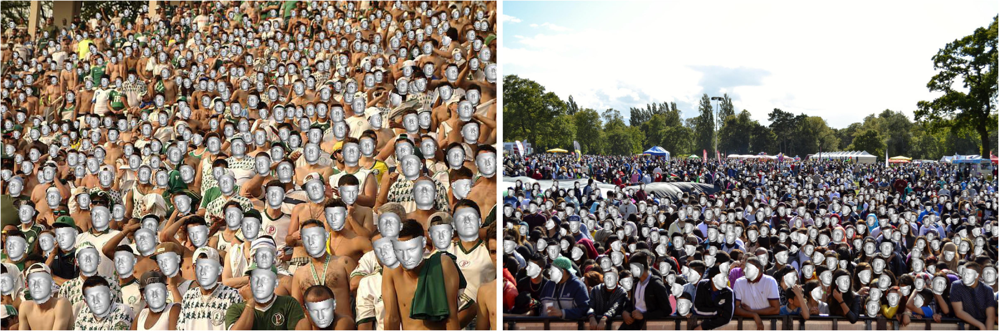

# img2pose: Face Alignment and Detection via 6DoF, Face Pose Estimation

<figure>
  
  <figcaption>Figure 1: We estimate the 6DoF rigid transformation of a 3D face (rendered in silver), aligning it with even the tiniest faces, without face detection or facial landmark localization. Our estimated 3D face locations are rendered by descending distances from the camera, for coherent visualization.</figcaption>
</figure>


### Abstract
> We propose real-time, six degrees of freedom (6DoF), 3D face pose estimation. We observe that estimating the 6DoF rigid transformation of a face is a simpler problem than facial landmark detection, often used for 3D face alignment. In addition, 6DoF offers more information than face bounding box labels. We leverage these observations to make multiple contributions: (a) We describe an easily trained, efficient, Faster R-CNN–based model which regresses 6DoF pose for all faces in the photo, without preliminary face detection. (b) We explain how pose is converted and kept consistent between the input photo and arbitrary crops created while training and evaluating our model. (c) Finally, we show how face poses can replace detection bounding box training labels. Tests on AFLW2000-3D and BIWI show that our method runs at real-time and outperforms state of the art (SotA) face pose estimators. Remarkably, our method also surpasses SotA models of comparable complexity on the WIDER FACE detection benchmark, despite not been optimized on bounding box labels.

### Authors
Vítor Albiero, Xingyu Chen, Xi Yin, Guan Pang, Tal Hassner

### Citation
```
@InProceedings{img2pose,
    author = {Vítor Albiero, Xingyu Chen, Xi Yin, Guan Pang, Tal Hassner},
    title = {img2pose: Face Alignment and Detection via 6DoF, Face Pose Estimation},
    booktitle = {arxiv},
    year = {2020}
}
```

## Code will be released here soon.
